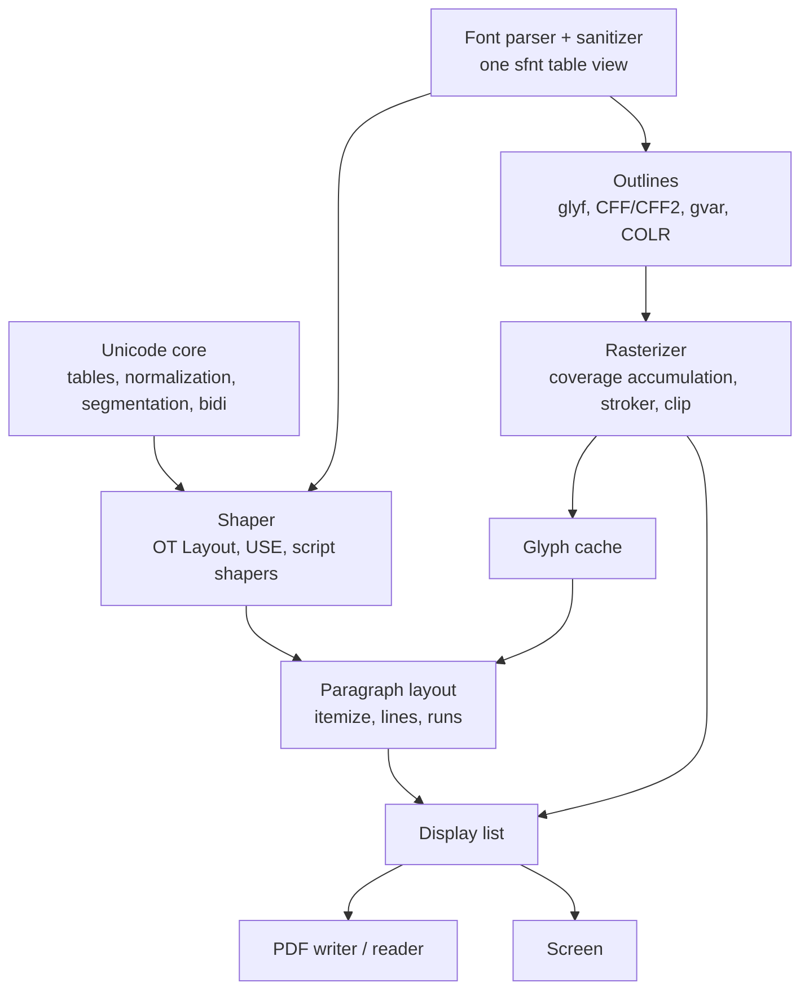

# In-House Text Stack: The Case for Unifying FreeType, HarfBuzz, ICU and PDF

2026-09-21 · @Someone

## Thesis

Build one in-house C89 text stack — font parsing, shaping, rasterization, Unicode, paragraph layout, and PDF read/write — rather than vendoring FreeType, HarfBuzz, and ICU separately. The three incumbents are a single problem split by history, and a from-scratch project is the one moment the seams can be erased.

The case rests on four points. First, the split is accidental: FreeType (1996) and HarfBuzz (extracted from Pango a decade later) each parse the same font tables and glue themselves together through indirection that exists only because they are separate binaries; ICU is where Unicode tables happened to live. Second, the pieces the text engine needs from ICU are already inside the shaper's dependencies, so "combining" them is not integration work but the absence of it. Third, PDF is the display list the layout engine already produces, so a PDF writer is a serializer and a PDF reader is a deserializer of one shared structure. Fourth, and decisively for feasibility: the oracles already exist. HarfBuzz's shape corpus, Unicode's conformance files, and FreeType's own output give exact or near-exact targets for every layer except perceptual rendering quality.

What this buys, concretely: one sanitized table view instead of two parsers; one variation-coordinate set; one glyph cache; one rasterizer for glyphs and page vector graphics; byte offsets into UTF-8 as the single currency for cursors, search, annotations, and PDF ToUnicode; exact post-shaping font subsetting; WYSIWYG print by construction; and a single debugging surface from font bytes to printed page.

What it costs: the ability to swap any half for its upstream later, roughly 60–100k lines of exacting code across the whole stack, and a rendering-quality tier that no test suite can judge for you. For a 1.0-and-done project the first cost is nil; the second is what AI-assisted volume makes affordable; the third is where taste has to be spent.

## Why now

This project was unreasonable five years ago and is reasonable in 2026 for three independent reasons.

**The unified design has been proven in production, in Rust.** Google Fonts' fontations project built a single sanitized parser (`read-fonts`), put outlines, hinting, and color glyphs on it (`skrifa`), and then the HarfBuzz maintainers ported HarfBuzz onto the same parser as HarfRust — explicitly to avoid maintaining two implementations of core font parsing. Chrome removed FreeType from Blink in release 145 in favor of this stack; typst is migrating to it. The question "is a shared parser under shaper and rasterizer a good idea" is no longer theoretical. It also means the cleanest reference implementations to read are now these Rust ports, not the C/C++ originals.

**ICU has been re-imagined as modular, data-driven crates.** ICU4X, from the Unicode Consortium itself, ships properties, normalization, segmentation, collation, and formatting as separate pieces with locale data compiled per use. It is the sanctioned admission that ICU's monolith was an accident of the 1990s (UTF-16, bundled 30 MB data file), and it demonstrates the generator-plus-tables architecture this document proposes.

**AI-assisted volume changes what "one person" can carry.** The stack is 60–100k lines of code whose difficulty is care, not invention: table parsers, state machines from published rules, an interpreter for a documented charstring format. Every layer has a specification and most have a conformance corpus. That is precisely the shape of work where an AI produces the bulk and the human spends attention on the oracle results and on the parts (rendering quality, API shape) that require judgment.

The 1.0-and-done philosophy resolves the usual objection. Nobody vendors these libraries to swap them later; they vendor them because rewriting looked impossible. When the release is final and the code is owned, the option value of a swappable upstream is worth nothing, and the cost of every seam is paid forever.

## The incumbents as they are

The three libraries differ sharply in language, license, and — most importantly for a rewrite — in how well their behavior is pinned down by tests.

| Library | Language | License | Required deps | Vendoring today | Test suite quality |
| --- | --- | --- | --- | --- | --- |
| FreeType | ANSI C, kept C89-clean | FTL (BSD-style, credit clause) or GPLv2 | none (zlib, PNG, HarfBuzz, Brotli optional) | easy: `FT2_BUILD_LIBRARY` + \~12 amalgamated .c files, edit `ftmodule.h` | weak: hash-compare against previous version, OSS-Fuzz, visual tools (`ftview`, `ftdiff`) |
| HarfBuzz | C++11, C API | Old MIT | none (FreeType optional) | easy but foreign: unity build of `src/harfbuzz.cc`, needs a C++ compiler | strong: thousands of data-driven shape tests, API tests, fuzz corpora, Uniscribe/CoreText-validated expectations |
| ICU | C++, C wrapper | Unicode License (BSD-style) | \~30 MB data file | impractical: nobody vendors it; distros ship it shared | strongest: runs Unicode's own conformance files plus its own `cintltst`/`intltest` |

Three observations follow. FreeType is the only C citizen and the only one whose behavior is not externally specified — its rasterizer's coverage values are simply what its algorithm produces. HarfBuzz's corpus encodes platform-compatibility decisions, not just the OpenType spec, which is valuable because those decisions are what fonts in the wild assume. ICU's most valuable asset is not its code but the conformance files it tests against, which come from unicode.org regardless of whether ICU is used.

On cadence: Unicode releases yearly (September), ICU and CLDR twice yearly, tzdata whenever a government moves a clock. Unicode's stability policies freeze normalization, case mapping, and properties of assigned characters, so a table snapshot ages gracefully; unknown new code points degrade to notdef and slightly wrong emoji segmentation. Only time zones genuinely rot, and only if the app converts wall-clock times.

## The seams

Every cost below exists only because three libraries are three binaries. None is a design decision anyone would make starting fresh.

**Two font parsers.** FreeType and HarfBuzz each read the sfnt directory, `cmap`, `head`, `hhea`, `hmtx`, `maxp`, `OS/2`, `post`, and the variation tables (`fvar`/`avar`; HarfBuzz reads `HVAR` for advances, FreeType reads `gvar` for outlines). Each carries its own sanitizer for the same bytes. HarfBuzz parses `cmap` because it cannot assume FreeType is present.

**The `hb_font_funcs` vtable.** HarfBuzz's font object is a table of callbacks (advance, extents, cmap lookup, glyph name) because it does not know who provides metrics. `hb-ft.cc` exists to bridge two libraries that both already read `hmtx`. In one library it is a direct call.

**Variations set twice.** Axis coordinates go to FreeType for outlines and to HarfBuzz for advances, and they must agree or text is subtly mispositioned.

**Hinting versus positioning.** Hinted advances differ from `hmtx` advances; the shaper needs to know which the renderer will use. `hb-ft` negotiates load flags for this. When both are one codebase, positioning policy (fractional advances with subpixel rendering, or hinted integer advances) is a mode.

**Color fonts split down the middle.** HarfBuzz has a paint API for `COLR`; FreeType has a layer API; `sbix`/`CBDT`/`SVG` fall between. Applications stitch them.

**No shared glyph cache.** The natural structure — one cache keyed by face, glyph, size, variation, and render mode, sitting beside both shaper and rasterizer — is reinvented above both libraries by every application.

**ICU's UTF-16.** ICU's `UnicodeString` and `UChar` APIs are 16-bit code units from a 1990s UCS-2 decision. In a UTF-8 codebase every call converts, and every offset ICU returns is in the wrong unit.

**The missing top layer.** Neither FreeType nor HarfBuzz nor ICU does paragraph layout: script itemization, bidi runs, line breaking, and line assembly. On Linux that is Pango; in Skia it is SkParagraph. Every application ends up writing or importing a fourth library to make the three do anything visible. In a unified engine this layer is the natural top of the stack rather than another integration project.

## Unified architecture

The stack is eight layers on one substrate. Each layer owns exactly one concern, depends only on layers below it, and is validated by its own oracle.

Reading it: the parser and Unicode core are the shared substrate; shaping and outline extraction sit on the parser; the rasterizer takes paths from anywhere; layout produces a display list that both the screen and the PDF layer consume.

| Layer | Owns | Does not own | Oracle |
| --- | --- | --- | --- |
| Unicode core | UTF-8 codec, property lookup, NFC/NFD/NFKC/NFKD, case mapping, grapheme/word/line/sentence breaks, UAX #9 bidi, UAX #24 script runs | locale data, collation, formatting | Unicode conformance files (exact) |
| Font parser | sfnt directory, table sanitization once at load, `cmap`, metrics, `name`, `post`, `fvar`/`avar`, in-place typed views over the bytes | any interpretation of glyph data | fuzz corpora; cross-check against `read-fonts` |
| Shaper | GSUB/GPOS/GDEF lookup engine, feature selection, coverage digests, USE, Arabic joining, fallback mark positioning, cluster tracking | rasterization, layout | HarfBuzz `test/shape` (exact glyph IDs and positions) |
| Outlines | `glyf` (incl. composites), CFF/CFF2 Type2 charstrings, `gvar`/CFF2 variation application, `COLR`/`CPAL` paint tree, bitmap strikes | hinting in 1.0 (see Scope) | path-level comparison with FreeType/skrifa outlines (exact up to rounding) |
| Rasterizer | signed-area coverage accumulation, nonzero and even-odd fill, stroker, clip masks, gamma/blend policy | text knowledge of any kind | mathematical reference (exact coverage at high oversampling) + FreeType golden bitmaps (tolerance) |
| Glyph cache | memoized rasterized glyphs keyed by face, glyph, size, variation, mode | — | — |
| Paragraph layout | itemization into runs (script, direction, font), line breaking on UAX #14 opportunities, justification, cursor and hit-testing on byte offsets | rich-text model | Pango/SkParagraph behavior by inspection; own regression corpus |
| Display list | positioned glyph runs, paths, images, clips, transforms — the one structure screen and PDF share | — | round-trip: write PDF, read it back, compare |

Two siblings live beside the stack, sharing the generator scripts but not the engine: **collation and calendars** (UCA with tailorings; Julian/Gregorian conversion and computus) and **font subsetting** (a font *writer*, needed only by the PDF writer and scoped to `glyf`/CFF plus metrics — never the GSUB/GPOS pruning that makes `hb-subset` large, because PDF viewers do not run layout).

Everything is C89 in one tree, unity-buildable, with arena allocation and no allocation in the shaping or rasterization hot paths. The Latin naming convention of the rest of the monorepo applies; names are left unsealed here.

## The string type and byte offsets

The string type is a two-word struct — `{ unsigned char *data; size_t len; }` — holding UTF-8 by convention, and everything Unicode-aware is a function over it. The struct stays dumb; byte offsets into it are the one currency every layer speaks.

The problem with `char*` was never Unicode; UTF-8 lives happily in a `char*`. The problem is NUL termination: no O(1) length, no substrings without copying, no embedded zeros, and every function rescans. Rust `str`, Go `string`, Zig `[]const u8`, SQLite `TEXT`, MuPDF, SDS, and Casey Muratori's `{size, data}` all converged on length-and-pointer UTF-8. UTF-16 (Java, JavaScript, .NET, Windows, Qt, ICU) is a 1990s UCS-2 decision nobody would repeat. Swift's grapheme-cluster `Character` was the principled experiment that made everything O(n); Swift 5 quietly moved to UTF-8 backing with byte-offset indices underneath.

Why this matters for the text stack specifically: HarfBuzz has no string type. It takes a slice, a range, and an encoding, decodes to 32-bit code points, and tags every output glyph with a **cluster value** — an index back into the original text. If that index is a byte offset into the same slice type the editor, the search index, the line breaker, the PDF ToUnicode writer, and anchored annotations all use, then an offset means one thing everywhere and no layer translates. Mix `char*`, code-point indices, and UTF-16 and the project spends its life off by one.

Design rules:

- One type, arena-allocated, no NUL; slicing is arithmetic. A `to_cstr` arena-copies with a trailing zero for the few libc calls that need it.
- Validate UTF-8 once where bytes enter (file, network, clipboard); repair with U+FFFD or reject there; never validate again. No `validated` flag or encoding tag in the struct — either the invariant holds past the boundary or there are two types.
- Byte offsets are the only index. `decode(str, &offset)` iterates code points; grapheme, word, and line segmentation are functions returning byte offsets, never an indexing unit.
- Cheap names mean cheap work: `str_length` is bytes, `str_equal` is byte equality, `str_upper` is ASCII. Unicode versions get distinct names (`str_grapheme_count`, `str_equal_canonical`, `str_upper_full`) so the cost is visible at the call site. Go gets this right (`len` vs `utf8.RuneCountInString`); Swift got it wrong (`count`).
- Store text as typed, unnormalized, so it round-trips byte-exact — necessary for a translation archive with provenance guarantees. Normalize to NFC only for comparison, search keys, and identifiers.
- One additional string type earns its keep: interned strings (pointer equality) for the compiler and symbol tables.

The library over the struct has three tiers of very different size. Tier 1 needs no tables: slicing, compare, find, split, hash, UTF-8 codec (a 30-line state machine), ASCII case and whitespace — a few hundred lines that 90% of code touches. Tier 2 is the generated-table tier: general category, combining class, script, bidi class, joining type, full case mapping with the special cases (ß, Turkish i, final sigma), normalization, segmentation, bidi — a few hundred KB of arrays plus state machines. Tier 3 is locale (collation, formatting) and is a sibling library, not part of the string.

## PDF on the same display list

A PDF page is positioned glyphs (by glyph ID, with a font resource), filled and stroked paths, and images under a transform — the display list the layout engine already produces. The PDF writer serializes it; the PDF reader deserializes into it; one rasterizer draws it for the screen. This is MuPDF's `fitz` architecture, and it is the strongest single argument for one tree.

**Building PDFs** is the smaller half and where in-house pays off most:

- Subsetting happens *after* shaping, from the exact glyph IDs the shaper emitted — ligature and mark glyphs included, which no codepoint-based subsetter can know to keep. The subsetter needs only `glyf`/CFF and metrics.
- ToUnicode is exact because the shaper's cluster values survive to the writer: `fi` maps back to "fi", a Hebrew base with three marks maps back to the right sequence. Third-party stacks lose this at the library boundary. `/ActualText` covers what the map cannot express.
- Positions are the fractional GPOS-derived values from layout, emitted as `TJ` adjustments, so the PDF viewer applies no kerning of its own. Print and screen share one layout run; WYSIWYG is a consequence, not a feature.
- Variable fonts cannot be embedded; instancing is `gvar` application, which the outline layer already does. Color fonts flatten through the same paint path as the screen.
- Structure is free: tagged PDF, PDF/UA, and PDF/A want a structure tree, and the layout engine knows headings, paragraphs, notes, and reading order. Print requirements (PDF/X, CMYK, bleed, KDP embedding rules) become writer modes.
- Private data round-trips: parallel-text alignment, apparatus notes, and annotation anchors can be embedded as metadata or private streams and read back, so a PDF from this engine reopens with its structure rather than as flat glyphs.

**Rendering PDFs** is the larger half:

- The rasterizer generalizes: nonzero and even-odd fills, a stroker (FreeType has one; HarfBuzz has none), clip masks, text under skewed matrices. Glyphs become paths like any other; there is no glyph-bitmap-then-composite seam.
- PDF fonts are hostile in ways OpenType on disk is not: Type1 with encrypted charstrings, bare CFF, TrueType subsets with no `cmap`, Type3 fonts that are content streams, `/Differences` arrays addressing glyphs by PostScript name. Every viewer accumulates font-loading hacks; MuPDF wraps FreeType in them, pdf.js rewrites fonts for the browser. An in-house parser exposes glyph-by-name and glyph-by-GID directly instead of contorting through a public API that assumes healthy fonts.
- Text extraction is the shaper's inverse; the parser exposes `post` names, reverse `cmap`, and ToUnicode uniformly.
- One debugging surface: a misplaced mark on a printed page reproduces in the same debugger from font bytes to emitter.

The scope discipline: a complete writer; a reader that handles everything the writer produces plus the common subset of the wild (embedded OpenType/CFF/Type1 text, paths, images, axial and radial shadings, standard filters); and a documented "not rendered" list for encryption variants, JBIG2, JPX, shading types 4–7, transparency groups, and blend modes. That is the difference between finishing and inheriting Ghostscript's issue tracker.

## Oracles

Each layer has a different kind of oracle, and the kind determines how the layer is developed. The rule: write the harness that replays the oracle before writing the layer, so every commit is measured against it.

| Layer | Oracle | Kind | How to use it |
| --- | --- | --- | --- |
| Unicode core | `NormalizationTest.txt`, `BidiTest.txt`, `BidiCharacterTest.txt`, `GraphemeBreakTest.txt`, `WordBreakTest.txt`, `LineBreakTest.txt`, `SentenceBreakTest.txt`, `CaseFolding.txt`, `SpecialCasing.txt` | spec-level, exact | A C test runner per file. These define correctness independently of any implementation; passing them means done. Pin a Unicode version and record it. |
| Shaper | HarfBuzz `test/shape/data/` (in-house, `aots`, `text-rendering-tests`) | implementation-level, exact | Each line: font, options, input, expected glyph IDs and positions. Write a \~300-line C replayer that parses the lines and calls your `shape`. Skip their Meson/Python harness entirely. Start with the Latin/Greek/Hebrew subset; widen by script as shapers land. |
| Shaper (robustness) | HarfBuzz `test/fuzzing/` corpora | crash/hang only | Run under a sanitizer build; free coverage of malformed fonts. |
| Font parser | HarfBuzz and FreeType fuzz corpora; `read-fonts` as a second opinion | crash + agreement | Dump parsed table fields from both and diff. Disagreements are usually your bug, occasionally theirs. |
| Outlines | FreeType (`FT_Outline`) and skrifa path output for the same glyph and coordinates | implementation-level, exact up to rounding | Compare point lists; treat ≤1 font-unit deltas as rounding. Composite glyphs and CFF2 variations are where diffs cluster. |
| Rasterizer (correctness) | A slow exact reference: 16× or 64× supersampled scanline fill of the same path | mathematical, exact | Coverage per pixel should match the reference within the accumulation algorithm's known error. This is the one oracle you write yourself, and it is small. |
| Rasterizer (compatibility) | FreeType golden bitmaps: render your font corpus at a range of sizes, store PNGs | opinion, tolerance | Per-pixel delta threshold plus exact match on glyph bounds and advances. Matching within a few gray levels is close enough to consensus for unhinted grayscale. |
| PDF writer | Round-trip through your own reader; Acrobat/Preview/pdf.js/MuPDF by inspection; `qpdf --check` and veraPDF for structure | mixed | Golden PDFs diffed as decompressed object streams. External validators catch spec violations viewers tolerate. |
| PDF reader | Your writer's output; a small curated corpus of wild PDFs; MuPDF's rendering as golden bitmaps | mixed | Same tolerance diff as the rasterizer. Keep the wild corpus small and named; it is not a target, it is a smoke test. |
| Paragraph layout | none external | own corpus | Freeze line-break and cursor-position outputs for a corpus of your own texts once they look right. Regression, not correctness. |
| Rendering quality | none | eyes | See Risks. |

Three cautions. HarfBuzz's corpus encodes Uniscribe and CoreText compatibility, not just the spec — that is a feature, since real fonts assume those behaviors, but a failing case may be a quirk rather than a rule, and reading HarfBuzz's source for that case is faster than deriving it. FreeType's golden output is FreeType's opinion; a persistent small difference is not necessarily wrong, only different, and the decision to match or diverge is a design choice to record. And every oracle is versioned — pin the HarfBuzz tag, Unicode version, and FreeType version the corpus came from, because "tests changed" and "code broke" must be distinguishable.

## Reference implementations

Read these for structure and decisions, not to transliterate. Where a Rust port exists it is usually the more legible source for "what does this table mean"; the C/C++ original is the source for "what does the world expect."

| Concern | Read | Take from it |
| --- | --- | --- |
| Table parsing | fontations `read-fonts`; FreeType `src/sfnt`, `src/truetype/ttpload.c` | Typed zero-copy views over bytes; the sanitize-once-then-trust-offsets boundary; which tables are optional in practice |
| Shaping engine | HarfBuzz `hb-ot-layout-gsubgpos.hh`, `hb-ot-shape.cc`; HarfRust (same structure, safe Rust); RustyBuzz history | Lookup-application loop and skipping rules; coverage digests (`hb-set-digest.hh`); the normalizer's interaction with `cmap`; `docs/backporting.md` for how the port tracks upstream |
| Script shapers | HarfBuzz `hb-ot-shaper-*.cc`; Microsoft's USE and script-specific OpenType specs | USE cluster grammar tables (generate them); Arabic joining state machine; leave Indic for last or never |
| Outlines | skrifa `outline`; FreeType `src/truetype/ttgload.c`, `src/cff/cffgload.c`, `src/psaux` | Composite glyph recursion limits; Type2 charstring interpreter; `gvar` delta application with IUP |
| Rasterizer | FreeType `src/smooth/ftgrays.c`; font-rs (Raph Levien); stb\_truetype v2 rasterizer; `fontdue` | Signed-area coverage accumulation; cell-based sparse accumulation for large glyphs; `ftstroke.c` for the stroker |
| Unicode tables | utf8proc; ICU4X `icu_properties` data layout; `libunibreak`; `fribidi` | Two-level (page index + page) lookup arrays; the UCD parsing scripts; UAX #14 pair-table approach; UAX #9 rule ordering |
| Paragraph layout | Pango `pango-layout.c`; Skia `SkParagraph`; `parley` (Linebender); `cosmic-text` | Itemization order (bidi → script → font fallback); line-breaking with hyphenation hooks; cursor and hit-test on byte offsets |
| Subsetting | HarfBuzz `hb-subset` (only the `glyf`/CFF/metrics paths); fonttools `subset` | Glyph renumbering with composite closure; CFF charstring/subr rewriting |
| PDF | MuPDF `source/fitz` and `source/pdf`; pdf.js `src/core/fonts.js` | Display-list design; the catalogue of font-loading hacks the wild requires; object-stream and xref handling |
| Glyph cache and text API | Skia `SkStrike`; DirectWrite's layered API (font face → font → text layout) | Cache key design; separating face (immutable) from font instance (size, variation, mode) |
| C style | stb libraries; Muratori's string and arena conventions; Eskil Steenberg's single-file library structure | Unity build; arena ownership; no allocation in hot paths; exposing internals rather than hiding them |

Licenses of the sources read: FreeType (FTL/GPLv2) and HarfBuzz (Old MIT) permit reading and even copying with attribution; a clean rewrite against the oracles avoids the question. Test *data* is separate: HarfBuzz's corpus includes some fonts with restrictive licenses, so keep test data outside the shipped tree.

## Scope and staging

1.0 is a complete text engine for the scripts actually typeset — Latin, Greek, Cyrillic, Hebrew — plus USE for breadth, with hinting and Indic explicitly out. The order below is chosen so that each stage produces something usable and each stage's oracle exists before its code.

1. **Table generator + Unicode core.** The UCD-to-C89 generator, then properties, UTF-8 codec, normalization, case mapping, segmentation, bidi. Oracle: conformance files. Usable on its own immediately (the string library).
2. **Font parser + sanitizer.** sfnt views, `cmap`, metrics, `name`, `post`, variation axes. Oracle: fuzz corpora, `read-fonts` diff.
3. **Outlines + rasterizer + glyph cache.** `glyf`, CFF, `gvar`; coverage rasterizer with stroker and clip; gamma policy decided here. Oracle: exact reference rasterizer, FreeType goldens. First visible text.
4. **Shaper, core OpenType Layout.** GSUB/GPOS/GDEF engine, feature selection, digests, normalizer, fallback mark positioning, `kern`. Oracle: HarfBuzz corpus filtered to Latin/Greek/Cyrillic/Hebrew. Covers everything lapide.org and Golden Earth typeset.
5. **Paragraph layout + display list.** Itemization, line breaking, justification, cursor and hit-testing. Oracle: own frozen corpus. The engine is now a document renderer.
6. **PDF writer + subsetter.** Post-shaping subsetting, ToUnicode from clusters, `TJ` positioning, tagged structure, PDF/A and PDF/X modes. Oracle: round-trip, external validators.
7. **PDF reader.** Parser, filters, content-stream interpreter, PDF font loaders, the documented "not rendered" list. Oracle: writer output, MuPDF goldens.
8. **USE + Arabic.** Table-driven Universal Shaping Engine, then Arabic joining. Oracle: the rest of the HarfBuzz corpus for those scripts.
9. **Color fonts and bitmap strikes**, if any fonts in use require them.

Deliberately out of 1.0, with reasons:

- **TrueType bytecode hinting and the autohinter.** Large, and the autohinter's behavior is defined only by itself. High-DPI screens and FreeType's own v40 "minimal" mode have made this matter less each year. Unhinted grayscale with fractional positioning and stem darkening is the modern default.
- **Indic, Myanmar, Khmer shapers.** A decade of Uniscribe-compatibility archaeology. The HarfBuzz corpus makes it survivable, but it would dominate debugging time for scripts the projects do not typeset.
- **GSUB/GPOS-pruning subsetting.** Only needed to ship fonts to other layout engines (web). PDF viewers never run layout.
- **AAT (`morx`/`kerx`) and Graphite.** Apple-only and niche-only.
- **Collation with tailorings, locale formatting, time zones.** Sibling library, separate decision. Julian/Gregorian conversion and the computus are small enough to be a footnote module.
- **Rendering PDFs from the wild in general.** See the "not rendered" list.

Each excluded item stays possible later precisely because its oracle already exists; nothing about the 1.0 design forecloses it.

## Risks

Ranked by how hard each is to retire, not by how often it is raised.

**1. Perceptual rendering quality — no oracle.** Stem darkening, gamma, subpixel positioning policy, the look of Latin at 11 px on a low-DPI display. FreeType's choices here are two decades of taste, and "matches golden bitmaps within tolerance" cannot say whether text looks muddy. Retired only by rendering a great deal of text and looking at it, on the actual displays the ecosystem targets. Budget real time for this; it is where the project can be quietly worse than the incumbents.

**2. Volume and review burden.** 60–100k lines of exacting code. An AI can produce it; the burden is that a wrong offset in one table parser silently misplaces a mark in one font. Mitigation: the oracles, run on every change; sanitizer builds; fuzzing from day one; never merging a parser without its diff against `read-fonts`. The long tail of Uniscribe quirks is bottomless only if Indic is in scope, which it is not.

**3. Performance — real but bounded.** HarfBuzz and FreeType are fast because of a few structural decisions, not cleverness: sanitize once then trust offsets; per-lookup coverage digests so most lookups are rejected in one AND; no allocation in the hot path; a glyph cache so nothing is rasterized twice. Copy those four and measure with the corpus as a benchmark. The arithmetic: a dense page is \~3,000 glyphs; at even 5 µs per glyph shaping is 15 ms per page, shaped once and cached. No plausible implementation makes a document viewer slow unless the layout layer re-shapes the whole document per keystroke, which is a layout bug.

**4. Robustness against hostile fonts.** Matters far less for an ecosystem that loads fonts it chose than for a browser, but a crash on a slightly odd font is embarrassing either way. The fuzz corpora are free; run them.

**5. Specification drift.** Unicode yearly, OpenType occasionally. Mitigated by keeping the generator: updating tables is a regeneration, not a source change. Font-format additions (CFF2 was 2016, `COLR` v1 was 2021) arrive rarely and are optional.

**6. Scope creep toward "render any PDF."** The single most likely way to not finish. Mitigated by the written "not rendered" list and by treating the wild-PDF corpus as a smoke test, never a target.

## Practical guidance

Decisions to make on purpose at the start, because each is cheap then and expensive later.

**Architecture**

- Sanitize once at load; thereafter every table access is a typed view over the original bytes with no copying and no re-checking. This is both the performance boundary and the security boundary. A `check(offset, size)` that runs at load and a `trust` view that runs after is the whole pattern.
- Separate *face* (immutable: parsed tables, digests, outline data) from *font instance* (size, variation coordinates, rendering mode). Caches key on the instance; shaping keys on the face plus coordinates.
- Build per-lookup coverage digests when the face loads. This one structure is most of the shaper's speed.
- Shape in font units and scale at the end; never round positions before layout is done.
- The display list is the contract between layout and everything downstream. Design it before the PDF writer and before the screen renderer, and make its serialization stable enough to diff.
- Arena allocation everywhere; shaping and rasterization take a scratch arena and allocate nothing else. Buffers are reused across calls.
- Unity build: one translation unit per library, or one for the whole stack, in the stb/Steenberg manner.

**Data**

- The UCD/CLDR generator is a first-class tool in the tree, not a one-off script. It emits two-level lookup arrays (page index + 256-entry pages) and records the Unicode version in the generated header. Adding a property is one line in the generator.
- Keep oracle corpora and golden files outside the shipped source, versioned with the tag they came from.
- Store strings unnormalized; normalize for keys. Record this rule where the archive format is specified.

**Workflow**

- Harness first: for each layer, write the replayer for its oracle before the layer, and make the harness the build's test target. A layer is "done" when its oracle passes, not when it looks right.
- Diff against a second implementation wherever one exists (`read-fonts` for parsing, skrifa for outlines, HarfBuzz for shaping). Two independent opinions localize bugs faster than one oracle.
- Fuzz continuously from the first parser; sanitizer builds are the default in development.
- Render-and-look sessions on a schedule for the quality tier, with a fixed set of specimen pages (small Latin body text, Greek with breathings, pointed Hebrew, mixed-direction lines) on the target displays.
- Record every deliberate divergence from an incumbent's behavior (a rasterizer that differs from FreeType by design, a shaping quirk not reproduced) in one file, so a future failing oracle case can be checked against intent.

**API shape**

- One entry point per layer with a struct of options, no global state, no callbacks into the caller. The C API surface is what the interpreter, the LSP, and the shell will all bind to; keep it small and boring.
- Expose internals rather than hide them: the parsed table views, the shaped buffer with clusters, the display list. The value of an in-house stack is that the next tool up can reach in.
- Byte offsets in, byte offsets out, everywhere.

## Addendum: findings from lapide.org, the Brighton note, and rhubarb

The body above stands as written on 2026-09-21. This addendum records what a review of the lapide.org corpus, the "Further work on Lapide.org" note, and the rhubarb tree adds or contradicts. Three findings matter; the first cuts against a decision in the body.

### Context: what the Brighton note proposes

The note ("Further work on Lapide.org", Obsidian vault, September 2026) is the source of most end uses below; this summary is for a reader who has not seen it.

lapide.org today is a static site of \~35-language translations of Cornelius a Lapide's commentaries, generated by an AI pipeline from OCR of roughly twenty 800-page scanned PDFs, with an epub and a search page. The translation is complete but a first draft: a chapter-by-chapter review against the OCR and the original page images has found significant issues in every chapter, and the work has stalled partly because the scope needs to grow before it can resume. The note then lays out that larger scope:

- **Page images beside the text.** Every scanned page should be viewable next to the Latin and the English, as the floor of quality control. This needs a text-to-page mapping at minimum, and ideally spatial mapping of sentences to regions of the image and alignment of Latin paragraphs to their translations. Hosting all page images is itself an open problem (the current GitHub-hosted repo is already large).
- **Brighton**, a web application (later desktop via `vitrea`) combining three roles: a **reader** (highlights, ebook-style and sentence-by-sentence pagination, reading groups, marginalia and glosses, essays assembled from extracts, annotations indexed by Bible verse or saint); a **GitHub-like layer** (issues anchored to text ranges, the Latin transcription and page image behind any passage, the translation rubric that produced each sentence, public issue history, a text-administrator view); and a **publishing layer** (LLM translation tasks, task tracking, human translation where wanted).
- **A stable address scheme** for text: `c1.s4.pxyz7.abcd8.2` — chapter, section, paragraph, sentence. Paragraph IDs are Merkle hashes over their sentences; sentence IDs hash the sentence text (Crockford base32, uuid5-style) with a mint-order disambiguator; superseded IDs redirect to their successors. Addresses are meant to work across mirrors and federated servers, so texts can deep-link into each other.
- **A single-file book format**, `.brighton`, probably SQLite, holding sentence metadata, page images, and translation state; mountable as a git repo of small files so an LLM can edit it, and publishable as a git repo for mirroring.
- **Per-sentence translation provenance**: each translated sentence in each language records the rubric version, date, and model used, so stale translations can be found by query. Rubrics cover terminology (dulia, hyperdulia), Bible quotation style, saint names, and register.
- **Indexing and an encyclopedia**: entities (persons, places, events, cited works) shared across texts, with coverage tracking and generated-then-edited entries, themselves translated with provenance; over time cross-work deep links (a Lapide citation of St. Basil resolving to a translated Basil in the reader's language, falling back to English).
- **Language learning** tools over the corpus (flashcards, exercises, graded by the user's own AI subscription), later shareable as courses.
- **Long term**: the same platform for other scholarly domains (mathematics, medicine, the sciences) with embedded computation, a claim graph for disputed questions, and a federated server binary others can host — explicitly within the 1.0-and-done philosophy.

The parts of this that bear on the text stack are the page-image alignment, the address scheme's dependence on sentence segmentation and normalization, and the implied outputs (PDF and epub per language, print, a desktop reader). The rest is Brighton's own concern.

### The corpus contradicts the 1.0 script scope

lapide.org already publishes in Arabic, Farsi, Hebrew, Hindi, Bengali, Tamil, Malayalam, Gujarati, Thai, Chinese, Japanese, and Korean, alongside the Latin-script majority. For the web reader this costs nothing: WebKit shapes them. But the note's ambitions — epub and PDF per language, print books, a desktop app, the .brighton file — mean the in-house stack must eventually put those languages on paper, and the body's scope (Latin, Greek, Cyrillic, Hebrew first; Indic out) means no Hindi or Tamil PDF until the Indic shaper lands.

Three options, none chosen here:

| Option | What moves into 1.0 | Cost | What it buys |
| --- | --- | --- | --- |
| Keep the body's scope | nothing | none now | Non-Latin-script PDFs wait for later stages |
| Pull Arabic and USE forward | Arabic joining shaper, USE tables | moderate | Arabic, Farsi, and most "other" scripts; still no Indic |
| Let the corpus decide | Arabic, USE, Indic cluster | the Indic shaper's Uniscribe archaeology | Every published language on paper |

Two further script facts the body omits. Thai, Lao, Khmer, and Burmese line breaking under UAX #14 is dictionary-based — ICU ships word lists for it — so "segmentation from generated tables" is incomplete for Thai however shaping is scoped. CJK needs kinsoku line-break rules and per-script font fallback, both in the layout layer, not the shaper.

### Rhubarb already holds more of the substrate than the body assumes

Mapping existing libraries onto the architecture's layers:

| Layer in the body | Already in rhubarb | Gap |
| --- | --- | --- |
| String type | `chorda` — `{i32 mensura; i8* datum}`, arena, no NUL; `utf8.h` decode/encode/next/prior | none at Tier 1 |
| Unicode core (Tier 2) | nothing: `chorda_minuscula` is ASCII, no properties, no normalization | the whole tier — the true first stage |
| Sentence segmentation | `sententia_fissio` — byte-offset sentence splitting with abbreviation and quote handling | must be versioned per text (see below) |
| Rasterizer output | `fenestra` → `TabulaPixelorum` → `delineare` software framebuffer with clip rect | glyph cache composites into `delineare`; `fons_6x8` is what outlines replace |
| Rasterizer oracle | `imago_collatio` (antialias-aware diff) + `specimen` (goldens in git, missing golden fails) + `imago_png` (deterministic) | none — the golden-bitmap harness exists |
| PDF filters | `flatura` (deflate) for `FlateDecode`; `stb_image` for `DCTDecode` JPEG | JBIG2/JPX stay out (see scans) |
| Identity | `sigillum` SHA-256, `moneta` ULID, `uuid`, `mintid` Crockford base32 | none |
| EPUB writer | `xml`, `stml`, HTML/CSS lexers, `capitula` ToC, `flatura` | zip container only |
| Page designators | `paginatio` — roman-vs-arabic page series as a type | exactly the text-to-scan-page mapping the note wants |
| Calendars | `calendarium_liturgicum`, `sanctorale`, `fasti` | the ICU calendar sibling partly exists |
| Screen UI | `vitrea` (WKWebView) | Brighton as a web app gets text from WebKit, not this stack |

The segmenter deserves a sentence of its own. The Brighton address scheme hashes sentences, so `sententia_fissio` is load-bearing for identity: change one rule and every sentence ID in the archive changes. Its rules should be the UAX #29 sentence rules plus a documented abbreviation list, frozen or versioned per text. `sententiae.h` already seals normalized text with SHA-256, which is the in-house precedent for "store unnormalized, hash normalized"; the specific key normalization (NFC, whitespace collapse, quote style) should be written down once, because polytonic Greek and pointed Hebrew have several valid encodings for the same visible text.

### The first consumer is PDF output, which reorders staging

Because Brighton is web-first, the stack's first real consumer is not the screen but PDF and print. A PDF writer needs the parser, Unicode core, shaper, subsetter, and paragraph layout — not the rasterizer, since PDF text is glyph IDs. The rasterizer is needed only by the PDF reader and native screens. The shortest path to a shipped deliverable is therefore:

1. Unicode core
2. Font parser + sanitizer
3. Shaper (Latin, Greek, Cyrillic, Hebrew)
4. Paragraph and page layout
5. Subsetter + PDF writer — first deliverable: a Golden Earth print PDF or a per-language lapide PDF
6. Outlines + rasterizer + glyph cache
7. PDF reader
8. USE, Arabic, and whatever the scope decision above adds

The body's stage 3 moves to stage 6 with nothing lost.

### What a publisher's PDF writer needs that the body under-weights

- **Hyphenation.** Liang's algorithm over the `hyph-utf8` TeX patterns (Latin, English, and most of the 35 languages, permissively licensed). Small, and required for justified book text.
- **Knuth-Plass line breaking** for print, alongside greedy breaking for screen. A few hundred lines.
- **A page-layout tier above paragraphs**: columns, footnotes, running heads, page numbers, and the marginal apparatus the note's gloss ambition implies — the classical Glossa Ordinaria layout problem. This deserves its own line in Scope rather than living inside "paragraph layout."
- **Printed indices.** The note's indexing element (persons, places, cross-work entities) implies per-language alphabetically sorted index pages, which is the first concrete consumer of the collation sibling.

### The scans

Archive.org and Google Books PDFs typically encode pages as JBIG2 (bitonal) or JPX — exactly the decoders the body excludes. The right move is a one-time offline extraction to PNG or JPEG into the .brighton file, after which the in-house reader only meets images `stb_image` decodes. The note's spatial text-to-region mapping is OCR bounding boxes (hOCR or ALTO) anchored to the same byte offsets; the display list overlays sentence regions on the page image with no new machinery.
